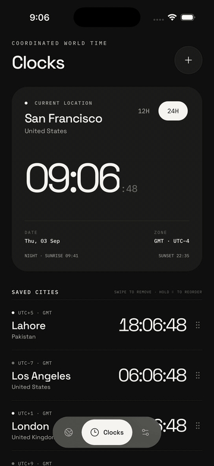
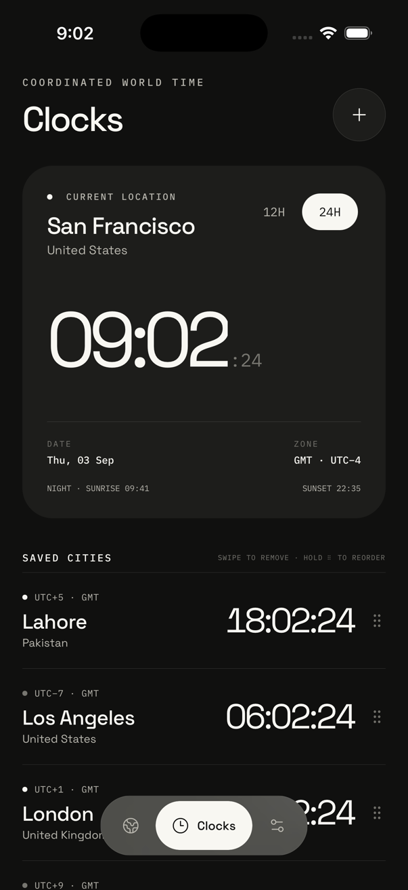
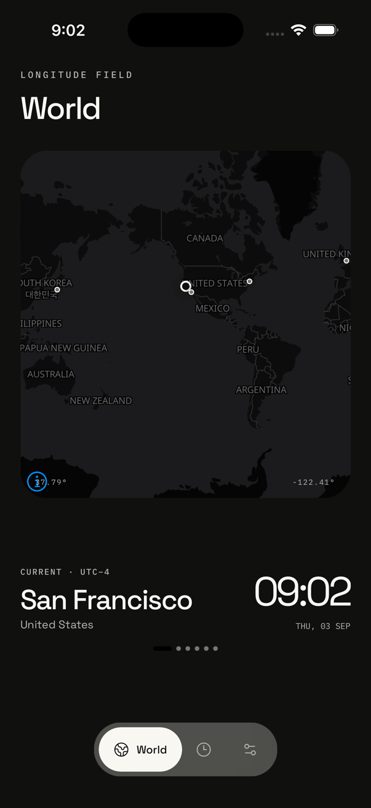
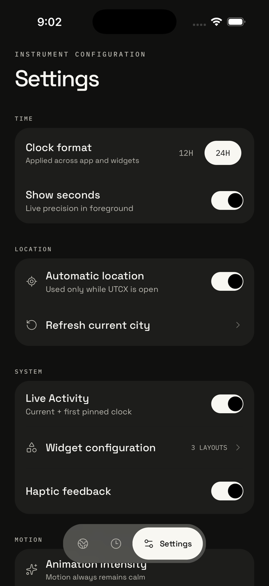
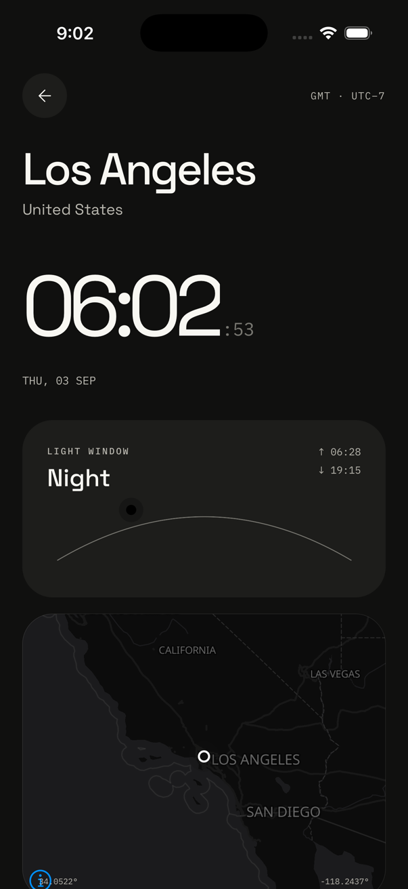
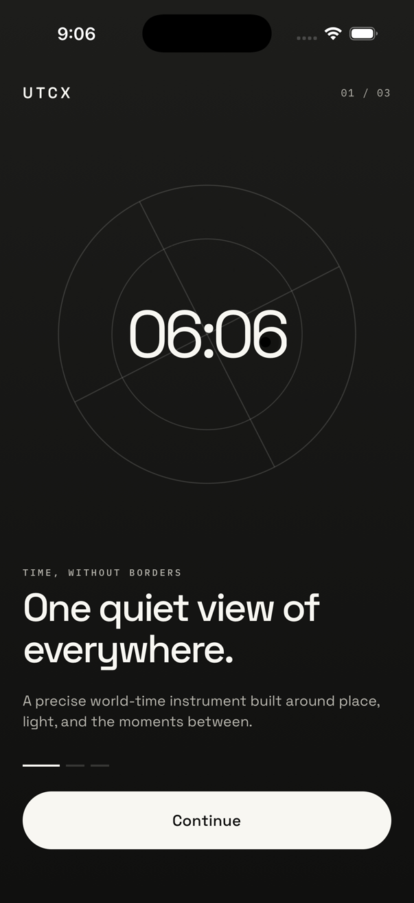

<div align="center">

# UTCX

### Coordinated world time, designed as a calm instrument.

A production-ready, local-first world clock for iOS and Android.



</div>

## The app

UTCX keeps the time, daylight window, and location of the places you care about in one precise interface. Search worldwide, save cities, compare time zones on a real map, and keep important clocks available through widgets and an iOS Live Activity.

- Live local and saved-city clocks with seconds and 12/24-hour formats.
- Worldwide place search powered by the Open-Meteo Geocoding API.
- Interactive MapLibre maps using OpenFreeMap and OpenStreetMap data.
- Foreground-only automatic location and solar sunrise/sunset calculations.
- Hold and drag to reorder clocks; inactive rows fade so the active clock stays clear.
- Swipe to remove saved cities, with calm fade-and-slide motion throughout.
- System, light, and dark appearance with adaptive monochrome accents.
- Three native widget layouts on iOS and Android, plus an iOS Live Activity.
- Safe-area-aware layouts for modern iPhone and Android displays.

## Screens

<p align="center">
  
  
  
</p>

<p align="center">
  
  
</p>

## Technology

| Area | Stack |
| --- | --- |
| App | Expo SDK 57, React Native 0.86, React 19, TypeScript 6 |
| Navigation | Expo Router |
| Maps | MapLibre React Native, OpenFreeMap, OpenStreetMap |
| State and storage | Zustand, react-native-mmkv |
| Time and daylight | Luxon, SunCalc |
| Motion and gestures | Reanimated, Gesture Handler, Expo Haptics |
| Native services | Expo Location, Safe Area Context, System UI |
| Widgets | Expo Widgets, WidgetKit, ActivityKit, Android AppWidget |
| Typography | Space Grotesk, IBM Plex Mono |

## Architecture

UTCX follows MVVM and keeps navigation, presentation, application state, and platform services separate:

```text
app/                 Expo Router routes and layouts
src/screens/         Screen views with sibling *.styles.ts files
src/viewmodels/      Screen state, derived values, and user actions
src/models/          Domain models
src/services/        Time, search, location, solar, widgets, and persistence
src/store/           Persisted Zustand application state
src/components/      Feature components and reusable UI primitives
src/theme/           Color, type, spacing, radius, and motion tokens
src/utils/           Search helpers and state validation
widgets/             iOS widgets and Live Activity layouts
plugins/             Android AppWidget Expo config plugin
```

Every reusable UI element has its own component folder, and screen styles remain beside their screen. Theme values are centralized so both appearance modes resolve from the same semantic tokens.

## Local setup

### Requirements

- Node.js 22.13.1 (the version is pinned in `.nvmrc`).
- Corepack and Yarn.
- Xcode with an iOS Simulator and CocoaPods for iOS.
- Android Studio with an Android SDK/JDK for Android.

UTCX requires a development build. Expo Go cannot load MMKV, MapLibre, WidgetKit, ActivityKit, or the Android AppWidget integration.

```sh
git clone https://github.com/musaJawad004/utcx.git
cd utcx

corepack enable
corepack yarn install
corepack yarn prebuild

# Run one platform
corepack yarn ios
corepack yarn android
```

After the first native build, start Metro with:

```sh
corepack yarn start
```

## Project commands

| Command | Purpose |
| --- | --- |
| `corepack yarn start` | Start the Expo development server |
| `corepack yarn ios` | Build and run the iOS app |
| `corepack yarn android` | Build and run the Android app |
| `corepack yarn prebuild` | Generate native iOS and Android projects |
| `corepack yarn typecheck` | Run the TypeScript compiler without emitting files |
| `corepack yarn doctor` | Check Expo dependency and project health |
| `corepack yarn export:ios` | Produce an iOS JavaScript export |
| `corepack yarn export:android` | Produce an Android JavaScript export |
| `corepack yarn widget:bundle` | Build the Expo Widgets bundle |

## Data and privacy

UTCX has no account system, analytics, or background location tracking. Saved cities and settings remain on the device. If automatic location is enabled, location access is requested only while the app is open. Worldwide searches are sent to the Open-Meteo Geocoding API, while map tiles come from OpenFreeMap with OpenStreetMap data.

## License

MIT. See [LICENSE](LICENSE).
